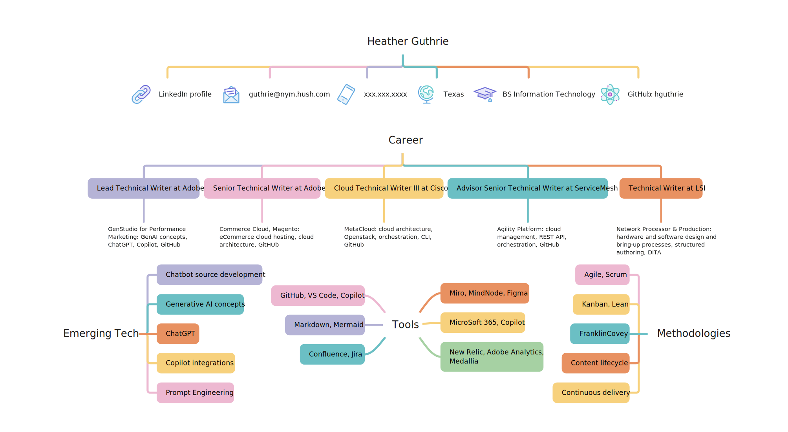
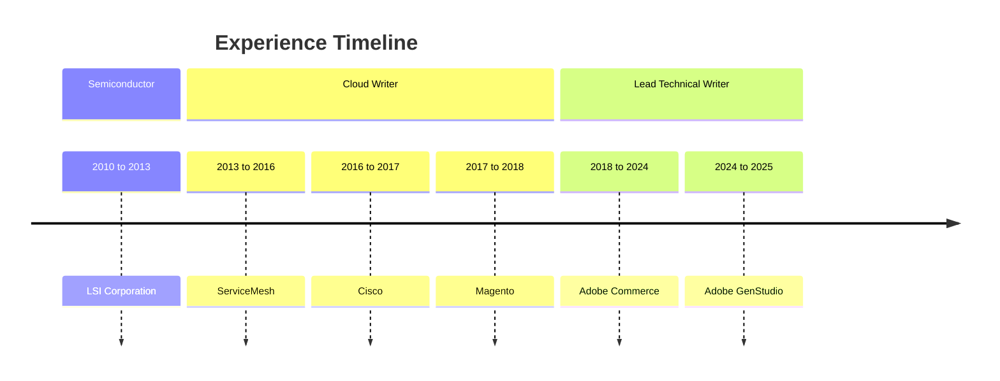

## Profile

I am an accomplished technical writer and content strategist specializing in emerging technologies, including generative AI. My recent experience focused on creating documentation for an AI platform while helping plan content frameworks that directly support chatbot training and prompt engineering. I combine clear communication with systems thinking—translating complex concepts into usable, scalable content for both people and machines.

I am interested in remote or hybrid roles in content strategy and software development. I am industry-flexible, and I have solid experience in startups and corporations. I love becoming a subject matter expert with the products that I encounter. I am thrilled to share my enterprise experience with a small to medium company. I look forward to building trust and helping shape content strategy for the future.

### MindNode resume

I use mind maps as I research and build content connections and strategies. MindNode is my mind-mapping tool of choice to organize concepts and data. I love the flexibility and visual tracking that mind-mapping exercises provide. The following is a visualization of my resume:

### Experience using mermaid

Mermaid is a great way to collaborate on diagrams directly in your Markdown code, especially if your content is open source. While not always beautiful, it is quick and easy to edit when writing in Markdown. The following is a sample timeline representing my experience throughout the years:

## Enterprise Portfolio

I enjoy working with [GitHub](https://github.com/hguthrie), and have for more than 10 years. I am very experienced in a docs-as-code environment.

### Lead Technical Writer for Adobe GenStudio for Performance Marketing

Develop documentation for the GenStudio for Performance Marketing product, crafting user guidance, prompt examples, and source materials designed to support both user understanding and LLM training. Partner with engineers and AI trainers to structure and optimize content used for chatbot development, while managing version-controlled documentation repositories and iterating on content strategy for emerging product features.

- [GenStudio for Performance Marketing Guide](https://experienceleague.adobe.com/en/docs/genstudio-for-performance-marketing/user-guide/home).

  Code repository: [genstudio-for-performance-marketing](https://github.com/AdobeDocs/genstudio-for-performance-marketing.en)

### Lead Technical Writer for Adobe Commerce and Commerce Cloud platform

Following Magento’s acquisition by Adobe, continued to document the Commerce Cloud product as it transitioned into the Adobe Commerce Cloud platform service and mentor new writers.

- [Commerce Cloud Tools portal](https://developer.adobe.com/commerce/cloud-tools/) and the [Cloud Docker for Commerce Guide](https://developer.adobe.com/commerce/cloud-tools/docker/).

   Code repository: [commerce-cloud-tools](https://github.com/AdobeDocs/commerce-cloud-tools)

- [Commerce on Cloud Infrastructure Guide](https://experienceleague.adobe.com/en/docs/commerce-on-cloud/user-guide/overview), before the repository was moved or renamed.

   Code repository: [commerce-on-cloud.en](https://github.com/AdobeDocs/commerce-on-cloud.en)

- [Configuration Guide](https://experienceleague.adobe.com/en/docs/commerce-operations/configuration-guide/overview).

   Code repository: [commerce-operations.en](https://github.com/AdobeDocs/commerce-operations.en)

### Senior Technical Writer for Magento

Documented cloud configuration processes and deployment procedures for hosting the Magento e-commerce application on a cloud platform. Created clear, technical documentation to support go-live readiness and ongoing site management.

- [Magento Developer Docs](https://github.com/magento-commerce/devdocs)—I worked in the Cloud Guide, before it migrated to Adobe Docs system.
