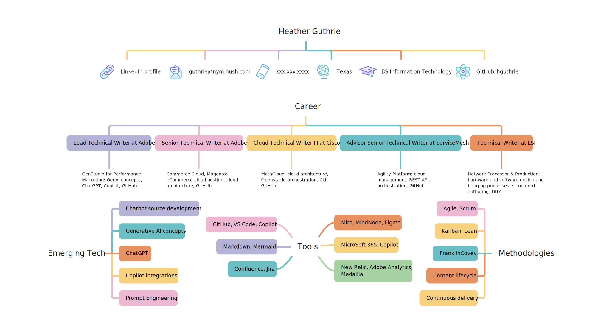
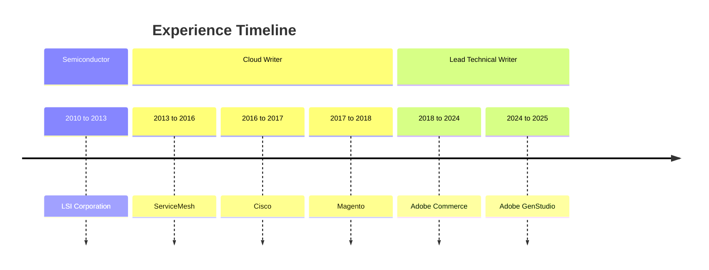

Mind maps and diagrams are excellent for gathering data, visualizing relationships, and forming ideas.

## MindNode resume

I have used MindNode for years to organize concepts and data. I love the flexibility and visual tracking that mind-mapping exercises provide. The following is a visualization of my resume:

## Example using mermaid

Mermaid is a great way to collaborate on diagrams directly in your markdown code. It is not always beautiful, but it is quick and easy to edit while writing in markdown.

Return [home](index.md).
