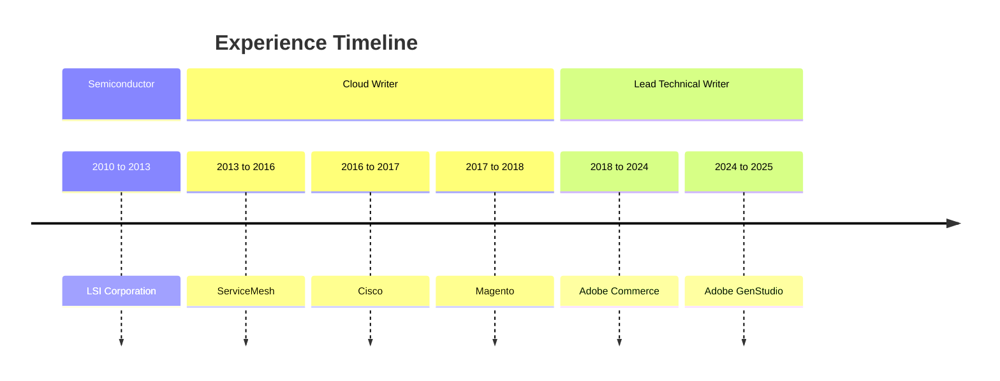

Mind maps and diagrams are excellent for gathering data, visualizing relationships, and forming ideas. In a product that may seem confusing at first, mind maps can help sort out the connections to certain states, decision trees, process flows, and information sources. It can help to identify crucial pathways for goal-oriented documentation, potentially enhancing the overall user experience.

## MindNode resume

MindNode is my mind-mapping tool of choice to organize concepts and data. I love the flexibility and visual tracking that mind-mapping exercises provide. The following is a visualization of my resume:

## Experience using mermaid

Mermaid is a great way to collaborate on diagrams directly in your Markdown code, especially if your content is open source. While not always beautiful, it is quick and easy to edit when writing in Markdown. The following is a sample timeline using my experience throughout the years:

Return to [profile](index.md).
